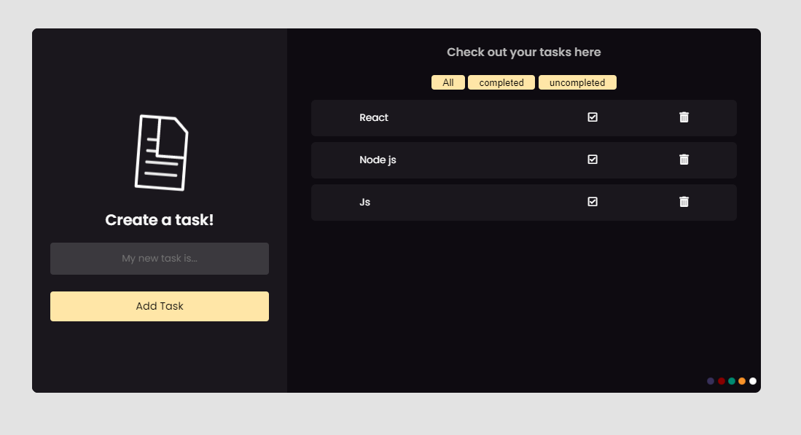

# To-do web application

## Welcome to my project guys! 👋

## Table of contents

- [Overview](#overview)
  - [The challenge](#the-challenge)
  - [Screenshot](#screenshot)
  - [Links](#links)
- [My process](#my-process)
  - [Built with](#built-with)
  - [What I learned](#what-i-learned)
  - [Continued development](#continued-development)
  - [Useful resources](#useful-resources)
- [Author](#author)
- [Acknowledgments](#acknowledgments)


## Overview

Thanks for checking out this front-end project  and i did the best i could to provide you with the cleanest and accurate codes. I hope this challenge codings help you improve your coding skills by building real projects.

Remember that "Every day is a learning day", so let's checkout the requirements to start such project

### The challenge

In his project you should be able to:

- Provide dynamic todo app which can filter todo items and also add different new todos which are not cleared after the broswer is closed 
- providing different backgrounds with js for the user
- Build and view the optimal layout depending on their device's screen size
- See hover states for interactive elements

### Screenshot




### Links

- Live Site URL: [3-column-preview-card-component](https://ellefamkar.github.io/todo-app-js)

## My process

### Built with

- Semantic HTML5 markup
- CSS
- Flexbox
- CSS Grid
- Mobile-first workflow
- js

You can use any tools you like to help you complete the project. So if you got something you'd like to practice, feel free to give it a try. However, i wrote this design with simple html5 and css, since my users should be able to: View the optimal layout

### What I learned

This projects helped me being more familiar with the details of js and DOM concept, and use my js knowledge as well to create a responsive project with small details and proficient.

To see parts of my codes and see how you can add code snippets, see below:

```html
   <div class="right-list-buttons">
                    <button class="all" value="all">All</button>
                    <button class="compeleted" value="compeleted">completed</button>
                    <button class="uncompleted" value="uncompleted">uncompleted</button>
    </div>
```
```css
.task-input:focus {
  -webkit-transition: var(--ease);
  transition: var(--ease);
  background-color: #5858586c;
  color: var(--bc-wht);
}

```
```js
// add new to do
function addToDo(e) {
   e.preventDefault(); //because it is a button and its default should be prevented
   const todoInputValue = todoInput.value; //get input value from input
   const todoSpan = document.createElement("span"); // create
   todoSpan.classList.add("list-item"); //give class to it
   todoSpan.innerHTML = `   
   <span class="list-item-value">${todoInputValue}</span>
    <span><i class="far fa-check-square"></i></span>
    <span><i class="fas fa-trash-alt"></i></span>
    `; //give content
   todoList.appendChild(todoSpan); //append to its parent
   saveToLocalStorage(todoInput.value); //save the given text to localstorage
   todoInput.value = ""; //reset value of input
}
```

If you want more help with writing markdown, we'd recommend checking out [The Markdown Guide](https://www.markdownguide.org/) to learn more.


### Continued development

In my future projects, not only i am going to focus on improving my basic knowledge of front end developmentso as to create cooler projects. I will also try to be much more familiar with UI design so as to better understand my clients needs and requirements.

### Useful resources

In order to do this project in a correct way you need to have a good knowledge of html and css, js and DOM , so let's master at them with these fruitful resources.

- [w3schools](https://www.w3schools.com/) - This helps you a lot with both your css and html which is easy to read and has numerous examples.
- [MDN](https://developer.mozilla.org/en-US/) - Remember that no matter how many tutorial videos you have watched, you always need to learn details and features from codes documentations
- [codeacademy](https://www.codecademy.com/)
- [udemy](https://www.udemy.com/) - Here you can find a number of tutorials in different languages
- [coursera](https://www.coursera.org/)

## Author

- Website - My website is under construction but you can find my works here : [Elle Famkar](https://github.com/ellefamkar)
- Twitter - [@Ellefamkar](https://www.twitter.com/ellefamkar)

Feel free to ask any questions come to your mind on my github account!

## Acknowledgments

I want to thanks my mentos who have been infuelntial and helpfull with great projects, tips and lessons. 


**Have fun using this project!** 🚀